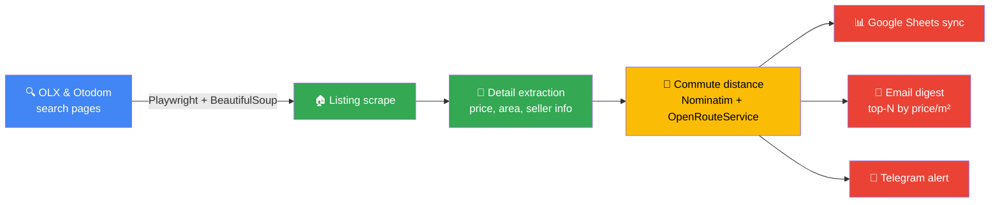

# Apartment Listing Scraper

An automated pipeline that scrapes rental/sale listings from Poland's two biggest
real-estate portals (OLX, Otodom), enriches every listing with commute time to an
address of your choice, and delivers the results straight to a Google Sheet with an
optional top-N email digest - no manual browsing required. Bring your own scheduler
(cron, systemd, `scheduler.py`) to run it automatically on a recurring basis.


## How it works



Deduplicates listings across sites and re-notifies only on genuinely new offers. Runs
on-demand by default; recurring runs are up to you (cron, systemd, or `scheduler.py`).

## Highlights

- **Resilient scraping at scale** - Playwright-driven browser automation with
  anti-detection measures (stealth scripts, locale/timezone spoofing, randomized
  delays) surviving two frequently-changing, JS-heavy sites
- **Multi-source data enrichment** - geocoding + travel-time API integration turns raw
  listings into a ranked, commute-aware shortlist
- **Automated delivery pipeline** - Google Sheets API sync, HTML email digests, and
  Telegram notifications; a bundled scheduler reads per-profile timing from each sheet's
  config tab (you host/run it - no managed infra included)
- **Production-minded engineering** - structured logging with debug HTML snapshots,
  configurable timeout profiles, dedup logic, and a pytest suite covering the parsing
  and filtering logic
- **Multi-tenant design** - any number of named search profiles (different
  cities/filters), each syncing to its own sheet with its own timing config and language

---

## Technical Documentation

### Features

- Playwright-based scraping of OLX and Otodom listing + detail pages, with
  anti-detection measures (stealth init script, Polish locale/timezone, randomized
  delays)
- Multiple named search profiles (price/area/room filters), each synced to its own
  Google Sheet
- Commute distance/duration to a fixed origin address via OpenRouteService
- Email digest of the best new listings (ranked by price per m²)
- Optional scheduler (`scheduler.py`) for running searches on a recurring basis - you
  keep it running via cron/systemd/similar
- Re-extraction from previously saved HTML without re-scraping

### Setup

```bash
pip install -r requirements.txt
playwright install chromium
python setup.py
```

`setup.py` checks your Python/dependency versions, verifies Google credentials are in
place, and walks you through creating `profiles.json` interactively.

#### 1. Google service account

1. Create a project in the [Google Cloud Console](https://console.cloud.google.com/),
   enable the Sheets API and Drive API.
2. Create a service account, generate a JSON key, and save it in the project root as
   `google-credentials.json` (or point the `GOOGLE_CREDS_PATH` env var at wherever you
   keep it).
3. Share each target Google Sheet with the service account's `client_email` (writer
   access), or use `create_sheet.py` to create and share a sheet for you:

   ```bash
   python create_sheet.py "My Apartment Search" you@example.com
   ```

#### 2. Search profiles

Copy the example and fill in your own search URLs, sheet IDs, and (optionally) email
settings:

```bash
cp profiles.example.json profiles.json
```

Each profile needs:

| Field | Description |
|---|---|
| `name` | Profile identifier, used with `--search` |
| `olx_url` / `otodom_url` | A saved search URL from either site (filters, location, price/area range) |
| `sheet_id` | Target Google Sheet ID (the long ID in the sheet's URL) |
| `origin_address` | Address used for commute distance calculation |
| `city` | City name, used for address parsing |
| `email_sender` / `email_recipient` / `email_app_password` | Optional, for the digest email (Gmail App Password, not your account password) |
| `language` | `en` or `pl` - language for Sheet column headers, the email digest and Telegram messages (default `en`). Can also be set from the sheet's `config` tab. |

#### 3. Environment variables

```bash
export OPENROUTESERVICE_API_KEY=your-key   # free tier at openrouteservice.org
export GOOGLE_CREDS_PATH=/path/to/google-credentials.json   # optional, defaults to ./google-credentials.json
```

### Usage

```bash
# Run the default profile
python apartment_scraper.py

# Run a specific profile
python apartment_scraper.py --search ursynow

# Re-extract data from a previously saved HTML/pickle snapshot
python apartment_scraper.py --reextract --pickle-file apartments_12.12.2025.pkl

# Standalone distance calculation
python apartment_scraper.py --calc-distance --office-address "Your Address, Warsaw"

# Debug mode: limit pages, skip the Google Sheets update
DEBUG_MODE=true DEBUG_MAX_PAGES=2 python apartment_scraper.py

# Run on a recurring schedule (reads days/time from each sheet's "config" tab)
python scheduler.py
```

#### Tests

```bash
pytest tests/ -v
```

### Project layout

| File | Purpose |
|---|---|
| `apartment_scraper.py` | Main scraper: listing scrape, detail extraction, distance calculation, Sheets sync |
| `email_report.py` | Builds and sends the top-N digest email |
| `logging_config.py` | Structured logging + HTML debug snapshots for failed extractions |
| `timeout_config.py` | Configurable Playwright timeout profiles |
| `scheduler.py` | Recurring-schedule runner, reads schedule from each sheet's config tab |
| `create_sheet.py` | Creates and shares a new Google Sheet for a profile |
| `migrate_config_sheets.py` | One-off helper to add a config tab to existing sheets |
| `setup.py` | First-run setup assistant |

### Pipeline details

1. **Listing scrape** - OLX/Otodom search-result pages are parsed with BeautifulSoup
   using CSS selector fallback chains (sites change markup often).
2. **Detail extraction** - Playwright visits each listing URL to pull the full
   description, seller info, and phone number where available.
3. **Distance calculation** - addresses are geocoded via Nominatim, then run through
   the OpenRouteService distance matrix API against your origin address.
4. **Google Sheets sync** - results are written to the "apartment list" worksheet of
   the profile's configured sheet.

### Troubleshooting

- **`Google credentials not found`** - `google-credentials.json` is missing or
  `GOOGLE_CREDS_PATH` points somewhere else. Re-run `python setup.py`.
- **Playwright browser launch fails** - run `playwright install chromium`.
- **Distance columns stay empty** - `OPENROUTESERVICE_API_KEY` isn't set; the scraper
  still runs fine without it, just skips distance calculation.

### Notes on site fragility

OLX and Otodom occasionally change their markup, which breaks CSS selectors. If a
scrape returns zero results, check the selector dictionaries near the top of
`apartment_scraper.py` (`OLX_SELECTORS`, `OTODOM_LISTING_SELECTORS`,
`OTODOM_DETAIL_SELECTORS`) against the live page's HTML and update as needed.

## License

[PolyForm Noncommercial 1.0.0](https://polyformproject.org/licenses/noncommercial/1.0.0) - see
[LICENSE](LICENSE). Free for noncommercial use; commercial use requires a separate
agreement with the copyright holder.
