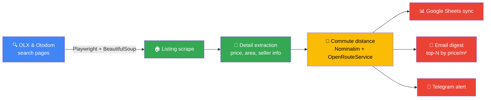

# Apartment Listing Scraper

An automated pipeline that scrapes rental/sale listings from Poland's two biggest
real-estate portals (OLX, Otodom), enriches every listing with commute time to an
address of your choice, and delivers the results straight to a Google Sheet with an
optional top-N email digest - no manual browsing required. Bring your own scheduler
(cron, systemd, `scheduler.py`) to run it automatically on a recurring basis.


## How it works



Deduplicates listings across sites and re-notifies only on genuinely new offers. Runs
on-demand by default; recurring runs are up to you (cron, systemd, or `scheduler.py`).

## Highlights

- **Resilient scraping at scale** - Playwright-driven browser automation with
  anti-detection measures (stealth scripts, locale/timezone spoofing, randomized
  delays) surviving two frequently-changing, JS-heavy sites
- **Multi-source data enrichment** - geocoding + travel-time API integration turns raw
  listings into a ranked, commute-aware shortlist
- **Automated delivery pipeline** - Google Sheets API sync, HTML email digests, and
  Telegram notifications; a bundled scheduler reads per-profile timing from each sheet's
  config tab (you host/run it - no managed infra included)
- **Production-minded engineering** - structured logging with debug HTML snapshots,
  configurable timeout profiles, dedup logic, and a pytest suite covering the parsing
  and filtering logic
- **Multi-tenant design** - any number of named search profiles (different
  cities/filters), each syncing to its own sheet with its own timing config and language

---

## Technical Documentation

### Features

- Playwright-based scraping of OLX and Otodom listing + detail pages, with
  anti-detection measures (stealth init script, Polish locale/timezone, randomized
  delays)
- Multiple named search profiles (price/area/room filters), each synced to its own
  Google Sheet
- Commute distance/duration to a fixed origin address via OpenRouteService
- Email digest of the best new listings (ranked by price per m²)
- Optional scheduler (`scheduler.py`) for running searches on a recurring basis - you
  keep it running via cron/systemd/similar
- Re-extraction from previously saved HTML without re-scraping

### Setup

```bash
pip install -r requirements.txt
playwright install chromium
python setup.py
```

`setup.py` checks your Python/dependency versions, verifies Google credentials are in
place, and walks you through creating `profiles.json` interactively.

#### 1. Google service account

1. Create a project in the [Google Cloud Console](https://console.cloud.google.com/),
   enable the Sheets API and Drive API.
2. Create a service account, generate a JSON key, and save it in the project root as
   `google-credentials.json` (or point the `GOOGLE_CREDS_PATH` env var at wherever you
   keep it).
3. Share each target Google Sheet with the service account's `client_email` (writer
   access), or use `create_sheet.py` to create and share a sheet for you:

   ```bash
   python create_sheet.py "My Apartment Search" you@example.com
   ```

#### 2. Search profiles

Copy the example and fill in your own search URLs, sheet IDs, and (optionally) email
settings:

```bash
cp profiles.example.json profiles.json
```

**How search URLs work**

Filters (price, area, rooms, district) are not set in `profiles.json` - they live inside
the search URL itself. Go to OLX or Otodom, apply all the filters you want in the UI,
then copy the URL from the address bar and paste it into `olx_url` / `otodom_url`. The
scraper will paginate through all results that URL returns.

**Minimal working profile**

```json
{
  "profiles": [
    {
      "name": "mokotow",
      "olx_url": "https://www.olx.pl/nieruchomosci/mieszkania/wynajem/warszawa/?search%5Bdistrict_id%5D=300&search%5Bfilter_float_price%3Ato%5D=4500&search%5Bfilter_float_m%3Afrom%5D=40",
      "otodom_url": "https://www.otodom.pl/pl/wyniki/wynajem/mieszkanie/wiele-lokalizacji?locations=%5Bmazowieckie%2Fwarszawa%2Fwarszawa%2Fwarszawa%2Fmokotow%5D&priceMax=4500&areaMin=40",
      "sheet_id": "1BxiMVs0XRA5nFMdKvBdBZjgmUUqptlbs74OgVE2upms",
      "origin_address": "Rondo ONZ 1, 00-124 Warszawa, Poland",
      "city": "Warszawa",
      "email_sender": "",
      "email_recipient": "",
      "email_app_password": "",
      "email_districts": "Mokotów",
      "email_top_n": 10,
      "language": "en"
    }
  ]
}
```

**Finding your Sheet ID**

Open the sheet in your browser. The ID is the long string between `/d/` and `/edit` in
the URL:

```
https://docs.google.com/spreadsheets/d/1BxiMVs0XRA5nFMdKvBdBZjgmUUqptlbs74OgVE2upms/edit
```

**Multiple profiles**

Add as many profiles to the `profiles` array as you need - one per search area, price
band, or city. Each profile syncs to its own sheet and sends its own email digest.

```json
{
  "profiles": [
    {
      "name": "mokotow",
      "olx_url": "https://www.olx.pl/nieruchomosci/mieszkania/wynajem/warszawa/?search%5Bdistrict_id%5D=300",
      "otodom_url": "https://www.otodom.pl/pl/wyniki/wynajem/mieszkanie/wiele-lokalizacji?locations=%5Bmazowieckie%2Fwarszawa%2Fwarszawa%2Fwarszawa%2Fmokotow%5D",
      "sheet_id": "SHEET_ID_A",
      "origin_address": "Rondo ONZ 1, 00-124 Warszawa, Poland",
      "city": "Warszawa",
      "email_sender": "you@gmail.com",
      "email_recipient": "you@gmail.com",
      "email_app_password": "abcd efgh ijkl mnop",
      "email_districts": "Mokotów",
      "email_top_n": 10,
      "language": "en"
    },
    {
      "name": "krakow-srodmiescie",
      "olx_url": "https://www.olx.pl/nieruchomosci/mieszkania/wynajem/krakow/?search%5Bfilter_float_price%3Ato%5D=4000",
      "otodom_url": "https://www.otodom.pl/pl/wyniki/wynajem/mieszkanie/malopolskie/krakow/krakow/krakow/srodmiescie?priceMax=4000",
      "sheet_id": "SHEET_ID_B",
      "origin_address": "Rynek Główny 1, 31-042 Kraków, Poland",
      "city": "Kraków",
      "email_sender": "you@gmail.com",
      "email_recipient": "you@gmail.com",
      "email_app_password": "abcd efgh ijkl mnop",
      "email_districts": "Śródmieście, Stare Miasto, Krowodrza",
      "email_top_n": 10,
      "language": "pl"
    },
    {
      "name": "gdansk-wrzeszcz",
      "olx_url": "https://www.olx.pl/nieruchomosci/mieszkania/wynajem/gdansk/",
      "otodom_url": "https://www.otodom.pl/pl/wyniki/wynajem/mieszkanie/pomorskie/gdansk/gdansk/gdansk",
      "sheet_id": "SHEET_ID_C",
      "origin_address": "Długi Targ 1, 80-828 Gdańsk, Poland",
      "city": "Gdańsk",
      "email_sender": "you@gmail.com",
      "email_recipient": "you@gmail.com",
      "email_app_password": "abcd efgh ijkl mnop",
      "email_districts": "Wrzeszcz, Oliwa, Śródmieście",
      "email_top_n": 10,
      "language": "pl"
    }
  ]
}
```

Run a specific profile:

```bash
python apartment_scraper.py --search mokotow
python apartment_scraper.py --search zoliborz
```

**Any Polish city**

The scraper is not Warsaw-specific. Set `city` to the city you're searching and build
your `olx_url` / `otodom_url` from that city's search pages. Geocoding bounds are
pre-configured for: Warszawa, Kraków, Gdańsk, Wrocław, Poznań, Łódź, Katowice,
Szczecin, Bydgoszcz, Gdynia, Lublin.

```json
{
  "name": "krakow-krowodrza",
  "olx_url": "https://www.olx.pl/nieruchomosci/mieszkania/wynajem/krakow/...",
  "otodom_url": "https://www.otodom.pl/pl/wyniki/wynajem/mieszkanie/malopolskie/krakow/...",
  "sheet_id": "YOUR_SHEET_ID",
  "origin_address": "Rynek Główny 1, 31-042 Kraków, Poland",
  "city": "Kraków",
  "email_districts": "Krowodrza, Śródmieście, Kleparz",
  "email_top_n": 10,
  "language": "pl"
}
```

**How `city` and `email_districts` work**

These two fields act as a two-level filter on the email digest:

| Field | What it does |
|---|---|
| `city` | Drops listings whose Address/Location field doesn't mention the city name. Prevents nearby suburbs scraped by OLX/Otodom from appearing in the digest. Diacritics are matched flexibly (`Krakow` matches `Kraków`). Leave empty to disable. |
| `email_districts` | Comma-separated list of district names. Narrows the digest further to only those specific districts within the city. Matches against Address, Location, and listing title. Empty = include all districts. |

Example - Warsaw, only Żoliborz and Bielany:
```json
"city": "Warszawa",
"email_districts": "Żoliborz, Bielany"
```

Example - Kraków, Stare Miasto and surrounding districts:
```json
"city": "Kraków",
"email_districts": "Śródmieście, Krowodrza, Kleparz, Stare Miasto"
```

Example - Gdańsk, no district filter (all of Gdańsk):
```json
"city": "Gdańsk",
"email_districts": ""
```

**How the email digest is sent**

The digest is generated by `email_report.py` and sent via SMTP after each scrape run.
It requires a Gmail account with [App Passwords](https://myaccount.google.com/apppasswords)
enabled (Settings → Security → 2-Step Verification → App Passwords). The regular Gmail
password does not work - you must generate a dedicated App Password.

```
Gmail account → Settings → Security → App Passwords → generate → paste into email_app_password
```

What the digest contains:
- Top `email_top_n` listings ranked by price per m² (best value first)
- Quality-gated: listings must have a photo, description ≥ 80 characters, known area and price
- Room-only listings and Cyrillic-language ads filtered out automatically
- Each card shows: title, address, price, area, price/m², commute distance, photo, link

The digest sends only when there are qualifying offers. If nothing passes the quality
gate, no email is sent (no noise).

**How Telegram notifications work**

Add `telegram_bot_token` and `telegram_chat_id` to a profile to receive a Telegram
message after each scrape run. The message shows new offer count, total count, the
cheapest listing with a link, and a direct link to the Google Sheet.

To set it up:

1. Open Telegram and message [@BotFather](https://t.me/BotFather). Send `/newbot`,
   follow the prompts, and copy the token it gives you (looks like `123456:ABC-DEF...`).
2. Start a chat with your new bot (or add it to a group), then open:
   ```
   https://api.telegram.org/bot<YOUR_TOKEN>/getUpdates
   ```
   Send a message to the bot, refresh the URL, and find `"chat":{"id":...}` in the JSON.
   That number is your `telegram_chat_id`.
3. Paste both into your profile:
   ```json
   "telegram_bot_token": "123456:ABC-DEFghijklmnop",
   "telegram_chat_id": "987654321"
   ```

Both fields must be set for notifications to send. Leave either empty to disable.

**Field reference**

| Field | Required | Description |
|---|---|---|
| `name` | yes | Profile identifier - used with `--search` |
| `olx_url` | yes | OLX search URL with your filters applied |
| `otodom_url` | yes | Otodom search URL with your filters applied |
| `sheet_id` | yes | Google Sheet ID (from the sheet's URL) |
| `origin_address` | yes | Full address used for commute time calculation |
| `city` | yes | City name (e.g. `Warszawa`, `Kraków`, `Gdańsk`). Used for geocoding bounds and to filter the email digest to listings within the city. |
| `email_sender` | no | Gmail address to send the digest from |
| `email_recipient` | no | Address(es) to receive the digest - comma-separated for multiple |
| `email_app_password` | no | Gmail App Password (not your account password) |
| `email_districts` | no | Comma-separated district names to restrict the digest to. Empty = all districts. |
| `email_top_n` | no | How many listings to include in the digest (default: 10) |
| `telegram_bot_token` | no | Telegram bot token from @BotFather |
| `telegram_chat_id` | no | Telegram chat/user ID to send notifications to |
| `language` | no | `en` or `pl` - controls column headers, email text, and Telegram messages (default: `en`) |

#### 3. Environment variables

```bash
export OPENROUTESERVICE_API_KEY=your-key   # free tier at openrouteservice.org
export GOOGLE_CREDS_PATH=/path/to/google-credentials.json   # optional, defaults to ./google-credentials.json
```

### Usage

```bash
# Run the default profile
python apartment_scraper.py

# Run a specific profile
python apartment_scraper.py --search ursynow

# Re-extract data from a previously saved HTML/pickle snapshot
python apartment_scraper.py --reextract --pickle-file apartments_12.12.2025.pkl

# Standalone distance calculation
python apartment_scraper.py --calc-distance --office-address "Your Address, Warsaw"

# Debug mode: limit pages, skip the Google Sheets update
DEBUG_MODE=true DEBUG_MAX_PAGES=2 python apartment_scraper.py

# Run on a recurring schedule (reads days/time from each sheet's "config" tab)
python scheduler.py
```

#### Tests

```bash
pytest tests/ -v
```

### Project layout

| File | Purpose |
|---|---|
| `apartment_scraper.py` | Main scraper: listing scrape, detail extraction, distance calculation, Sheets sync |
| `email_report.py` | Builds and sends the top-N digest email |
| `logging_config.py` | Structured logging + HTML debug snapshots for failed extractions |
| `timeout_config.py` | Configurable Playwright timeout profiles |
| `scheduler.py` | Recurring-schedule runner, reads schedule from each sheet's config tab |
| `create_sheet.py` | Creates and shares a new Google Sheet for a profile |
| `migrate_config_sheets.py` | One-off helper to add a config tab to existing sheets |
| `setup.py` | First-run setup assistant |

### Pipeline details

1. **Listing scrape** - OLX/Otodom search-result pages are parsed with BeautifulSoup
   using CSS selector fallback chains (sites change markup often).
2. **Detail extraction** - Playwright visits each listing URL to pull the full
   description, seller info, and phone number where available.
3. **Distance calculation** - addresses are geocoded via Nominatim, then run through
   the OpenRouteService distance matrix API against your origin address.
4. **Google Sheets sync** - results are written to the "apartment list" worksheet of
   the profile's configured sheet.

### Troubleshooting

- **`Google credentials not found`** - `google-credentials.json` is missing or
  `GOOGLE_CREDS_PATH` points somewhere else. Re-run `python setup.py`.
- **Playwright browser launch fails** - run `playwright install chromium`.
- **Distance columns stay empty** - `OPENROUTESERVICE_API_KEY` isn't set; the scraper
  still runs fine without it, just skips distance calculation.

### Notes on site fragility

OLX and Otodom occasionally change their markup, which breaks CSS selectors. If a
scrape returns zero results, check the selector dictionaries near the top of
`apartment_scraper.py` (`OLX_SELECTORS`, `OTODOM_LISTING_SELECTORS`,
`OTODOM_DETAIL_SELECTORS`) against the live page's HTML and update as needed.

## License

[PolyForm Noncommercial 1.0.0](https://polyformproject.org/licenses/noncommercial/1.0.0) - see
[LICENSE](LICENSE). Free for noncommercial use; commercial use requires a separate
agreement with the copyright holder.
